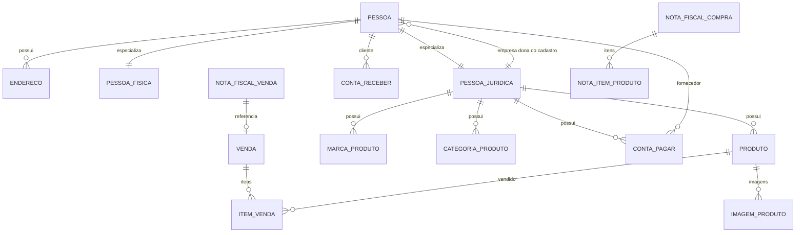

# Proposta de modelagem refatorada para a loja virtual

Esta proposta nao altera o projeto em `src/main`. Ela serve como guia para voce analisar, copiar por partes e evoluir a modelagem sem quebrar tudo de uma vez.

## Ideia principal

Fornecedor nao precisa ser uma tabela propria.

O melhor cenario para este projeto e tratar fornecedor como um **papel de Pessoa**. Assim:

- `Pessoa` e a entidade base.
- `PessoaFisica` e uma pessoa com CPF.
- `PessoaJuridica` e uma pessoa com CNPJ.
- Cliente, fornecedor, funcionario e empresa sao papeis/categorias dessa pessoa.
- `ContaPagar.fornecedor` deve apontar para `Pessoa`, nao obrigatoriamente para `PessoaJuridica`.

Isso resolve o problema de fornecedor externo:

- Se o fornecedor externo for uma empresa, cadastre como `PessoaJuridica` com papel `FORNECEDOR`.
- Se o fornecedor externo for uma pessoa comum, cadastre como `PessoaFisica` com papel `FORNECEDOR`.
- A empresa logada continua sendo o tenant/dono do cadastro, no campo `empresa`.

## Relacionamento recomendado



## Mudancas de conceito

1. Use `PessoaJuridica empresa` como dona do registro em quase todos os models multiempresa.
2. Use `Pessoa fornecedor` em `ContaPagar`.
3. Use `Pessoa cliente` em venda e conta a receber.
4. Remova ciclos obrigatorios:
   - `Produto` nao deve depender de `NotaItemProduto`.
   - `Venda` nao deve obrigatoriamente depender de `NotaFiscalVenda` no primeiro save.
   - `NotaFiscalVenda` pode apontar para `Venda`, mas normalmente a venda nasce antes da nota.
5. Troque `TABLE_PER_CLASS` por `JOINED` quando for fazer uma migracao de banco planejada.

## Enum novo sugerido

```java
package com.bandampla.lojavirtual.enums;

public enum TipoCadastroPessoa {
    CLIENTE,
    FORNECEDOR,
    FUNCIONARIO,
    TRANSPORTADORA,
    EMPRESA
}
```

## Models refatorados propostos

Os modelos abaixo mostram campos e relacionamentos. Getters, setters, `equals` e `hashCode` foram omitidos para leitura. Se copiar para o projeto, mantenha seu padrao atual desses metodos.

### Pessoa

```java
@Entity
@Table(name = "pessoa")
@Inheritance(strategy = InheritanceType.JOINED)
@SequenceGenerator(name = "seq_pessoa", sequenceName = "seq_pessoa", allocationSize = 1)
public abstract class Pessoa implements Serializable {

    @Id
    @GeneratedValue(strategy = GenerationType.SEQUENCE, generator = "seq_pessoa")
    private Long id;

    @Column(nullable = false)
    private String nome;

    @Column(nullable = false)
    private String email;

    @Column(nullable = false)
    private String telefone;

    @Enumerated(EnumType.STRING)
    @Column(nullable = false)
    private TipoPessoa tipoPessoa;

    @ElementCollection(fetch = FetchType.EAGER)
    @CollectionTable(name = "pessoa_tipo_cadastro", joinColumns = @JoinColumn(name = "pessoa_id"))
    @Enumerated(EnumType.STRING)
    @Column(name = "tipo_cadastro", nullable = false)
    private Set<TipoCadastroPessoa> tiposCadastro = new HashSet<>();

    @ManyToOne(fetch = FetchType.LAZY)
    @JoinColumn(name = "empresa_id", foreignKey = @ForeignKey(name = "pessoa_empresa_fk"))
    private PessoaJuridica empresa;

    @OneToMany(mappedBy = "pessoa", orphanRemoval = true, cascade = CascadeType.ALL)
    private List<Endereco> enderecos = new ArrayList<>();
}
```

### PessoaFisica

```java
@Entity
@Table(name = "pessoa_fisica")
@PrimaryKeyJoinColumn(name = "id")
public class PessoaFisica extends Pessoa {

    @Column(nullable = false, unique = true)
    private String cpf;

    @Temporal(TemporalType.DATE)
    private Date dataNascimento;
}
```

### PessoaJuridica

```java
@Entity
@Table(name = "pessoa_juridica")
@PrimaryKeyJoinColumn(name = "id")
public class PessoaJuridica extends Pessoa {

    @Column(nullable = false, unique = true)
    private String cnpj;

    @Column(unique = true)
    private String inscricaoEstadual;

    @Column(unique = true)
    private String inscricaoMunicipal;

    @Column(nullable = false)
    private String nomeFantasia;

    @Column(nullable = false)
    private String razaoSocial;

    private String categoria;

    @ManyToOne(fetch = FetchType.LAZY)
    @JoinColumn(name = "matriz_id", foreignKey = @ForeignKey(name = "pessoa_juridica_matriz_fk"))
    private PessoaJuridica matriz;
}
```

### Endereco

```java
@Entity
@Table(name = "endereco")
@SequenceGenerator(name = "seq_endereco", sequenceName = "seq_endereco", allocationSize = 1)
public class Endereco implements Serializable {

    @Id
    @GeneratedValue(strategy = GenerationType.SEQUENCE, generator = "seq_endereco")
    private Long id;

    @Column(nullable = false)
    private String rua;

    @Column(nullable = false)
    private String cep;

    @Column(nullable = false)
    private String numero;

    private String complemento;

    @Column(nullable = false)
    private String bairro;

    @Column(nullable = false)
    private String uf;

    @Column(nullable = false)
    private String cidade;

    @Enumerated(EnumType.STRING)
    @Column(nullable = false)
    private TipoEndereco tipoEndereco;

    @ManyToOne(fetch = FetchType.LAZY)
    @JoinColumn(name = "pessoa_id", nullable = false, foreignKey = @ForeignKey(name = "endereco_pessoa_fk"))
    private Pessoa pessoa;
}
```

### Usuario e Acesso

```java
@Entity
@Table(name = "usuario")
public class Usuario implements Serializable {
    @Id
    @GeneratedValue(strategy = GenerationType.SEQUENCE, generator = "seq_usuario")
    private Long id;

    @Column(nullable = false, unique = true)
    private String login;

    @Column(nullable = false)
    private String senha;

    @Temporal(TemporalType.TIMESTAMP)
    private Date createAt;

    @Temporal(TemporalType.TIMESTAMP)
    private Date updateAt;

    @ManyToMany(fetch = FetchType.EAGER)
    @JoinTable(name = "usuario_acesso",
        joinColumns = @JoinColumn(name = "usuario_id"),
        inverseJoinColumns = @JoinColumn(name = "acesso_id"))
    private List<Acesso> acessos = new ArrayList<>();

    @ManyToOne(fetch = FetchType.LAZY)
    @JoinColumn(name = "pessoa_id", nullable = false)
    private Pessoa pessoa;

    @ManyToOne(fetch = FetchType.LAZY)
    @JoinColumn(name = "empresa_id", nullable = false)
    private PessoaJuridica empresa;
}
```

```java
@Entity
@Table(name = "acesso")
public class Acesso implements GrantedAuthority {
    @Id
    @GeneratedValue(strategy = GenerationType.SEQUENCE, generator = "seq_acesso")
    private Long id;

    @Enumerated(EnumType.STRING)
    @Column(nullable = false, unique = true)
    private RoleUser roleUser;

    @JsonIgnore
    @Override
    public String getAuthority() {
        return roleUser.name();
    }
}
```

### CategoriaProduto e MarcaProduto

```java
@Entity
@Table(name = "categoria_produto",
       uniqueConstraints = @UniqueConstraint(name = "uk_categoria_empresa_nome",
       columnNames = {"empresa_id", "nome_descricao"}))
public class CategoriaProduto implements Serializable {
    @Id
    @GeneratedValue(strategy = GenerationType.SEQUENCE, generator = "seq_categoria_produto")
    private Long id;

    @Column(name = "nome_descricao", nullable = false)
    private String nomeDescricao;

    @ManyToOne(fetch = FetchType.LAZY)
    @JoinColumn(name = "empresa_id", nullable = false)
    private PessoaJuridica empresa;
}
```

```java
@Entity
@Table(name = "marca_produto",
       uniqueConstraints = @UniqueConstraint(name = "uk_marca_empresa_nome",
       columnNames = {"empresa_id", "nome_descricao"}))
public class MarcaProduto implements Serializable {
    @Id
    @GeneratedValue(strategy = GenerationType.SEQUENCE, generator = "seq_marca_produto")
    private Long id;

    @Column(name = "nome_descricao", nullable = false)
    private String nomeDescricao;

    @ManyToOne(fetch = FetchType.LAZY)
    @JoinColumn(name = "empresa_id", nullable = false)
    private PessoaJuridica empresa;
}
```

### Produto e ImagemProduto

```java
@Entity
@Table(name = "produto",
       uniqueConstraints = @UniqueConstraint(name = "uk_produto_empresa_nome",
       columnNames = {"empresa_id", "nome"}))
public class Produto implements Serializable {
    @Id
    @GeneratedValue(strategy = GenerationType.SEQUENCE, generator = "seq_produto")
    private Long id;

    @Enumerated(EnumType.STRING)
    @Column(nullable = false)
    private TipoUnidadeMedida tipoUnidadeMedida;

    @Column(nullable = false)
    private String nome;

    @Column(nullable = false)
    private Boolean ativo = Boolean.TRUE;

    @Column(columnDefinition = "text", nullable = false)
    private String descricao;

    @Column(nullable = false)
    private BigDecimal valorVenda = BigDecimal.ZERO;

    @Column(nullable = false)
    private Integer qtdEstoque = 0;

    private Integer qtdEstoqueMinimo = 0;
    private Boolean alertaEstoque = Boolean.FALSE;
    private Double peso;
    private Double largura;
    private Double altura;
    private Double profundidade;
    private String linkYoutube;
    private Integer qtdClickProduto = 0;

    @ManyToOne(fetch = FetchType.LAZY)
    @JoinColumn(name = "empresa_id", nullable = false)
    private PessoaJuridica empresa;

    @ManyToOne(fetch = FetchType.LAZY)
    @JoinColumn(name = "categoria_produto_id", nullable = false)
    private CategoriaProduto categoriaProduto;

    @ManyToOne(fetch = FetchType.LAZY)
    @JoinColumn(name = "marca_produto_id", nullable = false)
    private MarcaProduto marcaProduto;

    @OneToMany(mappedBy = "produto", cascade = CascadeType.ALL, orphanRemoval = true)
    private List<ImagemProduto> imagens = new ArrayList<>();
}
```

```java
@Entity
@Table(name = "imagem_produto")
public class ImagemProduto implements Serializable {
    @Id
    @GeneratedValue(strategy = GenerationType.SEQUENCE, generator = "seq_imagem_produto")
    private Long id;

    @Column(columnDefinition = "text", nullable = false)
    private String imagemOriginal;

    @Column(columnDefinition = "text", nullable = false)
    private String imagemMiniatura;

    @ManyToOne(fetch = FetchType.LAZY)
    @JoinColumn(name = "produto_id", nullable = false)
    private Produto produto;

    @ManyToOne(fetch = FetchType.LAZY)
    @JoinColumn(name = "empresa_id", nullable = false)
    private PessoaJuridica empresa;
}
```

### ContaPagar e ContaReceber

```java
@Entity
@Table(name = "conta_pagar")
public class ContaPagar implements Serializable {
    @Id
    @GeneratedValue(strategy = GenerationType.SEQUENCE, generator = "seq_conta_pagar")
    private Long id;

    @Column(nullable = false)
    private String descricao;

    @Enumerated(EnumType.STRING)
    @Column(nullable = false)
    private StatusContaPagar status;

    @Column(nullable = false)
    private BigDecimal valorTotal;

    private BigDecimal valorDesconto;

    @Temporal(TemporalType.DATE)
    @Column(nullable = false)
    private Date dataVencimento;

    @Temporal(TemporalType.DATE)
    private Date dataPagamento;

    @ManyToOne(fetch = FetchType.LAZY)
    @JoinColumn(name = "responsavel_id", nullable = false)
    private Pessoa responsavel;

    @ManyToOne(fetch = FetchType.LAZY)
    @JoinColumn(name = "fornecedor_id", nullable = false)
    private Pessoa fornecedor;

    @ManyToOne(fetch = FetchType.LAZY)
    @JoinColumn(name = "empresa_id", nullable = false)
    private PessoaJuridica empresa;
}
```

```java
@Entity
@Table(name = "conta_receber")
public class ContaReceber implements Serializable {
    @Id
    @GeneratedValue(strategy = GenerationType.SEQUENCE, generator = "seq_conta_receber")
    private Long id;

    @Column(nullable = false)
    private String descricao;

    @Enumerated(EnumType.STRING)
    @Column(nullable = false)
    private StatusContaReceber status;

    @Temporal(TemporalType.DATE)
    @Column(nullable = false)
    private Date dataVencimento;

    @Temporal(TemporalType.DATE)
    private Date dataPagamento;

    @Column(nullable = false)
    private BigDecimal valorTotal;

    private BigDecimal valorDesconto;

    @ManyToOne(fetch = FetchType.LAZY)
    @JoinColumn(name = "cliente_id", nullable = false)
    private Pessoa cliente;

    @ManyToOne(fetch = FetchType.LAZY)
    @JoinColumn(name = "empresa_id", nullable = false)
    private PessoaJuridica empresa;
}
```

### Venda, ItemVenda e StatusRastreio

```java
@Entity
@Table(name = "venda_compra_loja_virtual")
public class VendaCompraLojaVirtual implements Serializable {
    @Id
    @GeneratedValue(strategy = GenerationType.SEQUENCE, generator = "seq_venda_compra_loja_virtual")
    private Long id;

    @ManyToOne(fetch = FetchType.LAZY)
    @JoinColumn(name = "cliente_id", nullable = false)
    private Pessoa cliente;

    @ManyToOne(fetch = FetchType.LAZY)
    @JoinColumn(name = "endereco_entrega_id", nullable = false)
    private Endereco enderecoEntrega;

    @ManyToOne(fetch = FetchType.LAZY)
    @JoinColumn(name = "endereco_cobranca_id", nullable = false)
    private Endereco enderecoCobranca;

    @Column(nullable = false)
    private BigDecimal valorTotal;

    private BigDecimal valorDesconto;

    @Column(nullable = false)
    private BigDecimal valorFrete;

    @Column(nullable = false)
    private Integer diasEntrega;

    @Temporal(TemporalType.TIMESTAMP)
    @Column(nullable = false)
    private Date dataVenda;

    @Temporal(TemporalType.DATE)
    private Date dataEntrega;

    @ManyToOne(fetch = FetchType.LAZY)
    @JoinColumn(name = "forma_pagamento_id", nullable = false)
    private FormaPagamento formaPagamento;

    @ManyToOne(fetch = FetchType.LAZY)
    @JoinColumn(name = "cupom_desconto_id")
    private CupomDesconto cupomDesconto;

    @ManyToOne(fetch = FetchType.LAZY)
    @JoinColumn(name = "empresa_id", nullable = false)
    private PessoaJuridica empresa;

    @OneToMany(mappedBy = "vendaCompraLojaVirtual", cascade = CascadeType.ALL, orphanRemoval = true)
    private List<ItemVendaLoja> itens = new ArrayList<>();
}
```

```java
@Entity
@Table(name = "item_venda_loja")
public class ItemVendaLoja implements Serializable {
    @Id
    @GeneratedValue(strategy = GenerationType.SEQUENCE, generator = "seq_item_venda_loja")
    private Long id;

    @Column(nullable = false)
    private BigDecimal quantidade;

    @Column(nullable = false)
    private BigDecimal valorUnitario;

    @ManyToOne(fetch = FetchType.LAZY)
    @JoinColumn(name = "produto_id", nullable = false)
    private Produto produto;

    @ManyToOne(fetch = FetchType.LAZY)
    @JoinColumn(name = "venda_compra_loja_virtual_id", nullable = false)
    private VendaCompraLojaVirtual vendaCompraLojaVirtual;

    @ManyToOne(fetch = FetchType.LAZY)
    @JoinColumn(name = "empresa_id", nullable = false)
    private PessoaJuridica empresa;
}
```

```java
@Entity
@Table(name = "status_rastreio")
public class StatusRastreio implements Serializable {
    @Id
    @GeneratedValue(strategy = GenerationType.SEQUENCE, generator = "seq_status_rastreio")
    private Long id;

    private String centroDistribuicao;
    private String codigo;
    private String cidade;
    private String estado;
    private String status;

    @ManyToOne(fetch = FetchType.LAZY)
    @JoinColumn(name = "venda_compra_loja_virtual_id", nullable = false)
    private VendaCompraLojaVirtual vendaCompraLojaVirtual;

    @ManyToOne(fetch = FetchType.LAZY)
    @JoinColumn(name = "empresa_id", nullable = false)
    private PessoaJuridica empresa;
}
```

### NotaFiscalVenda, NotaFiscalCompra e NotaItemProduto

```java
@Entity
@Table(name = "nota_fiscal_venda")
public class NotaFiscalVenda implements Serializable {
    @Id
    @GeneratedValue(strategy = GenerationType.SEQUENCE, generator = "seq_nota_fiscal_venda")
    private Long id;

    @Column(nullable = false)
    private String numeroNota;

    @Column(nullable = false)
    private String serieNota;

    @Column(nullable = false)
    private String tipo;

    @Column(nullable = false)
    private String descricao;

    @Column(nullable = false)
    private BigDecimal valorTotal;

    private BigDecimal valorDesconto;
    private BigDecimal valorIcms;

    @Column(columnDefinition = "text")
    private String xml;

    @Column(columnDefinition = "text")
    private String pdf;

    @OneToOne(fetch = FetchType.LAZY)
    @JoinColumn(name = "venda_compra_loja_virtual_id", nullable = false, unique = true)
    private VendaCompraLojaVirtual vendaCompraLojaVirtual;

    @ManyToOne(fetch = FetchType.LAZY)
    @JoinColumn(name = "empresa_id", nullable = false)
    private PessoaJuridica empresa;
}
```

```java
@Entity
@Table(name = "nota_fiscal_compra")
public class NotaFiscalCompra implements Serializable {
    @Id
    @GeneratedValue(strategy = GenerationType.SEQUENCE, generator = "seq_nota_fiscal_compra")
    private Long id;

    @Column(nullable = false)
    private String numeroNota;

    @Column(nullable = false)
    private String serieNota;

    private String descricaoObservacao;

    @Column(nullable = false)
    private BigDecimal valorTotal;

    private BigDecimal valorDesconto;
    private BigDecimal valorIcms;

    @Temporal(TemporalType.DATE)
    @Column(nullable = false)
    private Date dataCompra;

    @ManyToOne(fetch = FetchType.LAZY)
    @JoinColumn(name = "fornecedor_id", nullable = false)
    private Pessoa fornecedor;

    @ManyToOne(fetch = FetchType.LAZY)
    @JoinColumn(name = "conta_pagar_id")
    private ContaPagar contaPagar;

    @ManyToOne(fetch = FetchType.LAZY)
    @JoinColumn(name = "empresa_id", nullable = false)
    private PessoaJuridica empresa;

    @OneToMany(mappedBy = "notaFiscalCompra", cascade = CascadeType.ALL, orphanRemoval = true)
    private List<NotaItemProduto> itens = new ArrayList<>();
}
```

```java
@Entity
@Table(name = "nota_item_produto")
public class NotaItemProduto implements Serializable {
    @Id
    @GeneratedValue(strategy = GenerationType.SEQUENCE, generator = "seq_nota_item_produto")
    private Long id;

    @Column(nullable = false)
    private BigDecimal quantidade;

    @Column(nullable = false)
    private BigDecimal valorUnitario;

    @ManyToOne(fetch = FetchType.LAZY)
    @JoinColumn(name = "nota_fiscal_compra_id", nullable = false)
    private NotaFiscalCompra notaFiscalCompra;

    @ManyToOne(fetch = FetchType.LAZY)
    @JoinColumn(name = "produto_id", nullable = false)
    private Produto produto;

    @ManyToOne(fetch = FetchType.LAZY)
    @JoinColumn(name = "empresa_id", nullable = false)
    private PessoaJuridica empresa;
}
```

### FormaPagamento, CupomDesconto e AvaliacaoProduto

```java
@Entity
@Table(name = "forma_pagamento")
public class FormaPagamento implements Serializable {
    @Id
    @GeneratedValue(strategy = GenerationType.SEQUENCE, generator = "seq_forma_pagamento")
    private Long id;

    @Column(nullable = false)
    private String descricao;

    @Enumerated(EnumType.STRING)
    @Column(nullable = false)
    private TipoFormaPagamento tipoPagamento;

    @ManyToOne(fetch = FetchType.LAZY)
    @JoinColumn(name = "empresa_id", nullable = false)
    private PessoaJuridica empresa;
}
```

```java
@Entity
@Table(name = "cupom_desconto")
public class CupomDesconto implements Serializable {
    @Id
    @GeneratedValue(strategy = GenerationType.SEQUENCE, generator = "seq_cupom_desconto")
    private Long id;

    @Column(nullable = false)
    private String codigoDescricao;

    private BigDecimal valorRealDesconto;
    private BigDecimal valorPorcentagemDesconto;

    @Temporal(TemporalType.DATE)
    @Column(nullable = false)
    private Date dataValidade;

    @ManyToOne(fetch = FetchType.LAZY)
    @JoinColumn(name = "empresa_id", nullable = false)
    private PessoaJuridica empresa;
}
```

```java
@Entity
@Table(name = "avaliacao_produto")
public class AvaliacaoProduto implements Serializable {
    @Id
    @GeneratedValue(strategy = GenerationType.SEQUENCE, generator = "seq_avaliacao_produto")
    private Long id;

    @Column(nullable = false)
    private String descricao;

    @Column(nullable = false)
    private Integer nota;

    @ManyToOne(fetch = FetchType.LAZY)
    @JoinColumn(name = "pessoa_id", nullable = false)
    private Pessoa pessoa;

    @ManyToOne(fetch = FetchType.LAZY)
    @JoinColumn(name = "produto_id", nullable = false)
    private Produto produto;

    @ManyToOne(fetch = FetchType.LAZY)
    @JoinColumn(name = "empresa_id", nullable = false)
    private PessoaJuridica empresa;
}
```

## Ordem segura para aplicar

1. Corrigir apenas `ContaPagar`: trocar `pessoaFornecedor` para `Pessoa fornecedor`.
2. Ajustar DTO, mapper, repository e service de conta a pagar.
3. Adicionar o enum `TipoCadastroPessoa`.
4. Adicionar `tiposCadastro` em `Pessoa`.
5. Padronizar `empresa` como `PessoaJuridica` nos models que ainda usam `Pessoa empresa`.
6. Remover `notaItemProduto` de `Produto`.
7. Remover obrigatoriedade de `notaFiscalVenda` dentro de `VendaCompraLojaVirtual`.
8. Planejar migracao para `InheritanceType.JOINED` com Flyway.

## Regra mental para nao confundir

- `empresa`: quem e dono/tenant do registro.
- `cliente`: quem compra.
- `fornecedor`: quem vende para sua empresa.
- `responsavel`: usuario/pessoa interna que lancou ou gerencia o registro.

Um fornecedor nao e uma empresa logada. Ele e uma `Pessoa` com papel `FORNECEDOR`.
